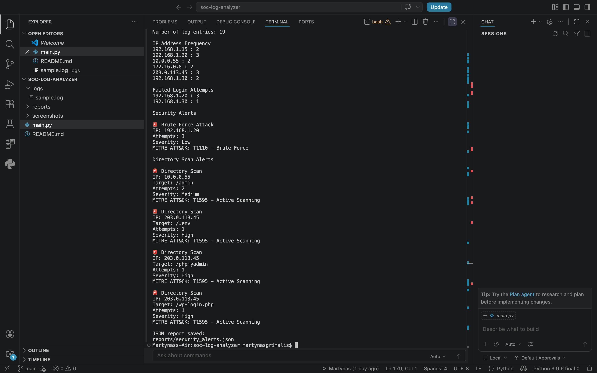

# SOC Log Analyzer

A Python-based cybersecurity project that analyzes web server logs to detect suspicious activity and generate security alerts.

This project was built as a portfolio project to demonstrate practical Security Operations Center (SOC) concepts, including log analysis, threat detection, alert prioritization, MITRE ATT&CK mapping, and JSON reporting.

---

## Features

- Parse and analyze web server log files
- Analyze IP address activity
- Detect failed login attempts
- Detect brute force attacks
- Detect directory scanning activity
- Reduce duplicate alerts with alert deduplication
- Assign alert severity (Low / Medium / High)
- Map detections to MITRE ATT&CK techniques
- Export alerts to JSON reports

---

## Detection Capabilities

### Brute Force Detection

The analyzer identifies repeated failed login attempts from the same IP address.

Example:

```text
🚨 Brute Force Attack

IP: 192.168.1.20
Attempts: 3
Severity: Low

MITRE ATT&CK:
T1110 - Brute Force
```

### Directory Scan Detection

The analyzer detects requests to sensitive paths commonly targeted during reconnaissance.

Examples include:

- `/admin`
- `/.env`
- `/phpmyadmin`
- `/wp-login.php`

Example:

```text
🚨 Directory Scan

IP: 203.0.113.45
Target: /.env
Attempts: 1
Severity: High

MITRE ATT&CK:
T1595 - Active Scanning
```

---

## Screenshot



---

## Example JSON Report

Alerts are exported automatically to:

```text
reports/security_alerts.json
```

Example:

```json
{
    "type": "Brute Force Attack",
    "ip": "192.168.1.20",
    "attempts": 3,
    "severity": "Low",
    "mitre_id": "T1110",
    "mitre_name": "Brute Force"
}
```

---

## Technologies
## Project Architecture

The project is organized into separate modules:

- `main.py` - application entry point
- `parser.py` - log file reading and IP extraction
- `detectors.py` - threat detection logic
- `reporting.py` - JSON report generation

This modular structure improves maintainability and allows easier expansion of detection rules.
- Python 3
- Git
- JSON
- Cybersecurity log analysis
- MITRE ATT&CK Framework

---

## Project Structure

```text
soc-log-analyzer/
│
├── main.py
├── parser.py
├── detectors.py
├── reporting.py
├── README.md
├── requirements.txt
├── .gitignore
│
├── logs/
│   └── sample.log
│
├── reports/
│   └── security_alerts.json
│
└── screenshots/
    └── soc-log-analyzer-output.png

---

## How to Run

Clone the repository:

```bash
git clone https://github.com/YOUR_USERNAME/soc-log-analyzer.git
```

Navigate to the project:

```bash
cd soc-log-analyzer
```

Run the analyzer:

```bash
python3 main.py
```

---

## Future Improvements

- Threat risk scoring
- IP reputation checks
- Additional MITRE ATT&CK mappings
- Detection of SQL Injection attempts
- Detection of XSS attempts
- Detection of Port Scanning
- Unit tests
- Modular project structure
- SIEM-style dashboard

---

## Author

Martynas Grimalis

Aspiring SOC Analyst / Junior Cybersecurity Specialist

GitHub: https://github.com/Martynasgrimalis
LinkedIn: https://www.linkedin.com/in/martynas-grimalis-18b4bb421/